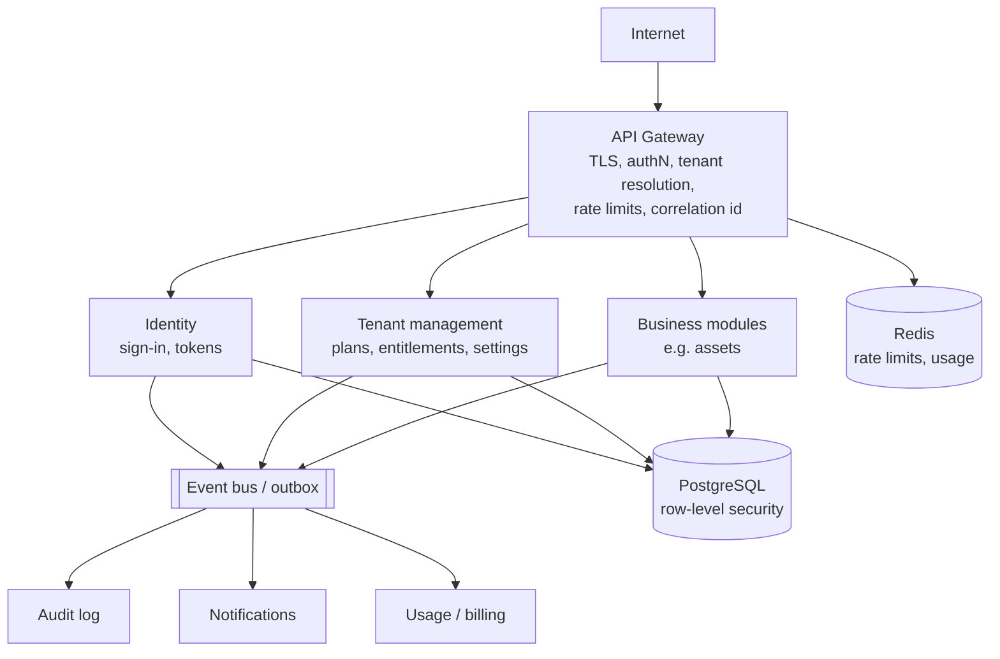
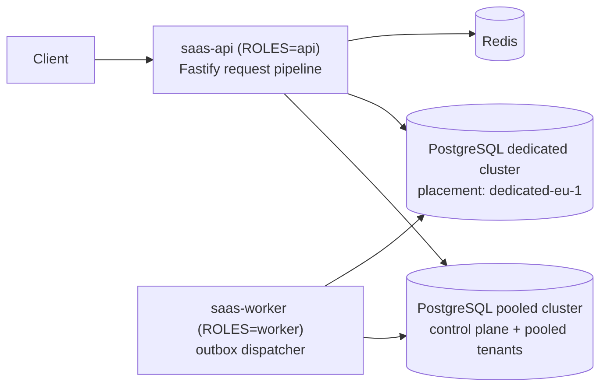
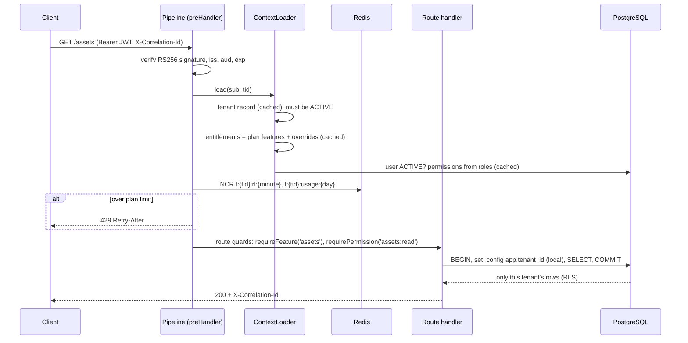
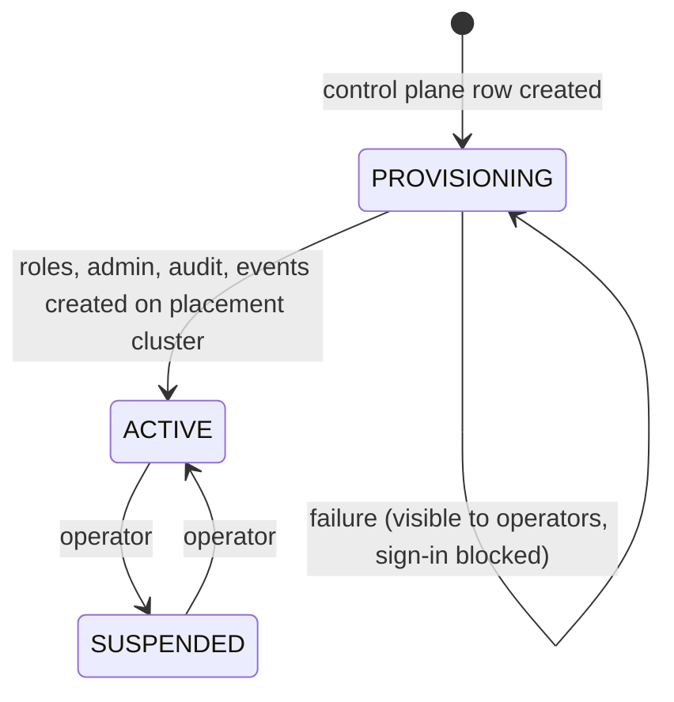
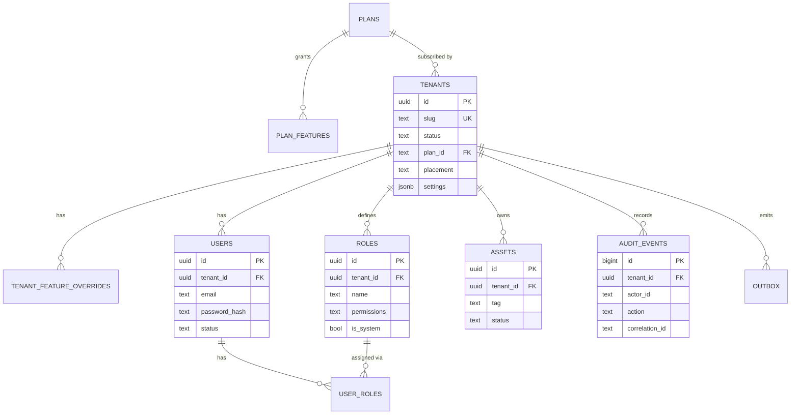

# Architecture

## Goals

- Serve many organisations (tenants) from shared infrastructure **without any possibility of cross-tenant data
  access**, enforced by the database and not only by application code.
- Let plans and per-tenant overrides control which modules and limits a tenant gets.
- Give large or regulated tenants **dedicated infrastructure without a code fork**.
- Keep every security-relevant change auditable.

## Logical architecture (target)

## Deployed architecture (this repository)

The reference implementation is a **modular monolith** ([ADR-001](decisions/ADR-001-modular-monolith-first.md)):
one deployable with strict module boundaries, run in two roles from the same image.

| Module | Responsibility | Key files |
|---|---|---|
| `tenancy` | Provisioning, placement, plans → entitlements, settings, request tenant context | `provisioning.ts`, `context-loader.ts`, `entitlements.ts` |
| `identity` | Tenant-aware sign-in, RS256 tokens, brute-force lockout | `routes.ts`, `tokens.ts` |
| `rbac` | Permission catalogue, system roles, custom roles | `permissions.ts`, `routes.ts` |
| `users` | User lifecycle, role assignment, plan user limits, last-admin protection | `routes.ts` |
| `assets` | Example business module (EAM asset register) | `routes.ts` |
| `audit` | Append-only audit trail written in the same transaction as each change | `audit.ts`, `routes.ts` |
| `usage` | Per-tenant rate limiting and usage metering (Redis) | `rate-limiter.ts` |
| `notifications` | Transactional outbox and dispatcher | `outbox.ts`, `dispatcher.ts` |
| `platform` | DB routing and tenant transactions, HTTP pipeline, errors, caching, logging, metrics | `db.ts`, `http/app.ts` |

Modules call each other only through exported functions; each module could become a service by replacing those
calls with HTTP/events — the database is already partitioned by tenant, and the outbox is already the
integration point.

## Request pipeline

## Tenant isolation: defence in depth

| Layer | Mechanism | What it prevents |
|---|---|---|
| 1. Identity | Tenant is part of the credential; token carries `tid`; token signature verified | Using one tenant's session in another |
| 2. Context | `TenantContext` built only from the verified token, never from path/query/body ([ADR-003](decisions/ADR-003-tenant-context-from-token-only.md)) | IDOR via `tenantId` parameters |
| 3. Data access | `withTenant()` opens a transaction and sets `app.tenant_id` locally | Forgetting to scope a query |
| 4. Database | RLS policies `USING` + `WITH CHECK` on every tenant table, `FORCE ROW LEVEL SECURITY`, non-owner app role | Any application bug reading or writing another tenant's rows |
| 5. Caches / Redis | All keys built with `tenantKey(tid, …)` | Cache poisoning across tenants |

Integration tests attack layer 4 directly with the app's database role: no tenant set → zero rows; inserting a
row for another tenant → rejected by RLS.

## Tenancy models and placement

See [tenancy-models.md](tenancy-models.md). In short: pooled shared-schema with RLS by default, plus a
**placement** column that routes a tenant's data to a dedicated cluster
([ADR-002](decisions/ADR-002-pooled-rls-with-placement.md)). The integration tests provision a tenant on a
dedicated cluster and verify its rows exist only there.

## Provisioning

## Authorization model

- Permissions are `<resource>:<action>` strings from a fixed catalogue.
- Roles are per tenant: three system roles (`tenant-admin`, `asset-manager`, `viewer`) created at provisioning,
  plus custom roles where the plan includes `custom-roles`.
- Permissions are resolved server-side on each request and cached for at most 30 s. A change is visible
  immediately on the instance that handled it (local invalidation) and within the cache TTL on other instances —
  instead of only at token expiry
  ([ADR-004](decisions/ADR-004-permissions-resolved-server-side.md)).
- Entitlements (plan features) and permissions are separate checks: a user can have `audit:read` but the tenant
  still needs the `audit-log` feature.

## Data model

Platform tables (`plans`, `plan_features`, `tenants`, `tenant_feature_overrides`) live on the control plane;
everything else is tenant-scoped with RLS.

## Evolution to services

| Step | Trigger | Change |
|---|---|---|
| Extract identity | Need for SSO/SCIM per tenant | Replace local sign-in with an IdP per tenant (OIDC/SAML); keep `tid` claim mapping |
| Extract modules | Independent team ownership or scaling | Module gets its own deployable; tenant context propagated via token; outbox → broker |
| Gateway | Several deployables | Move pipeline concerns (authN, rate limits) into an API gateway; services still enforce authorization and RLS |
| Event bus | More consumers of domain events | Outbox relay publishes to RabbitMQ/Kafka, as in [event-driven-platform](https://github.com/shivkumarsinghsky/event-driven-platform) |
