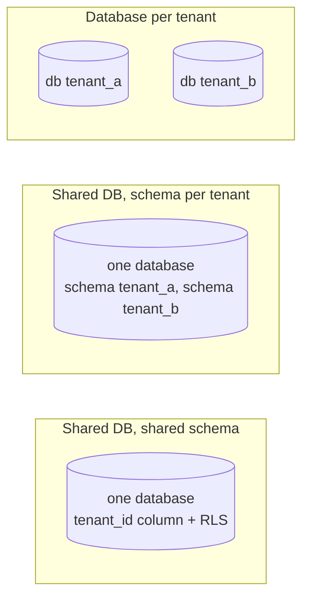

# Multi-Tenancy Models

Three standard ways to store data for many tenants, and why this platform uses a hybrid.

## Comparison

| Concern | Shared schema (pooled) | Schema per tenant | Database per tenant (silo) |
|---|---|---|---|
| Isolation | Logical — relies on `tenant_id` + RLS | Logical, stronger blast radius (search_path) | Physical |
| Cost per tenant | Lowest | Low–medium | Highest (min. instance size, connections) |
| Onboarding | Insert rows | Create schema + run migrations | Provision DB + migrations + secrets |
| Schema migrations | Once | N times (catalogue bloat beyond ~1K schemas) | N times across a fleet |
| Noisy neighbour | Highest risk — needs quotas | Shared CPU/IO | None (separate resources) |
| Per-tenant backup/restore | Hard: restore to side, copy by `tenant_id` | Medium: dump one schema | Easy |
| Per-tenant encryption keys | Column-level only | Possible per schema | Natural (per DB/volume) |
| Cross-tenant analytics | Easy | Union across schemas | Requires a pipeline |
| Connection pooling | Efficient | Efficient | Pool per tenant — scales poorly |
| Typical fit | Many small/medium tenants | Hundreds of mid-size tenants | Few large/regulated tenants |

## Chosen approach: pooled by default, dedicated by placement

- Every tenant-scoped table has `tenant_id` and an RLS policy; the app role is not the owner and has no
  `BYPASSRLS`.
- `tenants.placement` names the cluster that stores the tenant's data. `pooled` is the default; enterprise tenants
  can be placed on a dedicated cluster (`DEDICATED_DATABASES`). Code never chooses a database — it calls
  `withTenant(router, tenant, …)`.
- Because the dedicated cluster runs the *same* schema and RLS, there is one code path and one migration set.

### Moving a tenant from pooled to dedicated (runbook outline)

1. Provision the dedicated cluster and run migrations against it.
2. Put the tenant in read-only maintenance (or `SUSPENDED` for a short window).
3. Copy the tenant's rows table by table (`WHERE tenant_id = $1`, in FK order) to the dedicated cluster.
4. Verify row counts and checksums per table.
5. Update `tenants.placement`; invalidate caches (`PATCH /platform/tenants/:id` does this).
6. Re-enable the tenant; delete the pooled copies after the retention window.

Not automated in this repository — listed under Future Improvements in the README.

## Why not schema-per-tenant?

It is a reasonable middle ground, but it multiplies migrations and catalogue size with tenant count while still
sharing compute. With RLS, the pooled model gets comparable isolation guarantees at the query level; the
placement mechanism covers the tenants that genuinely need physical separation.
